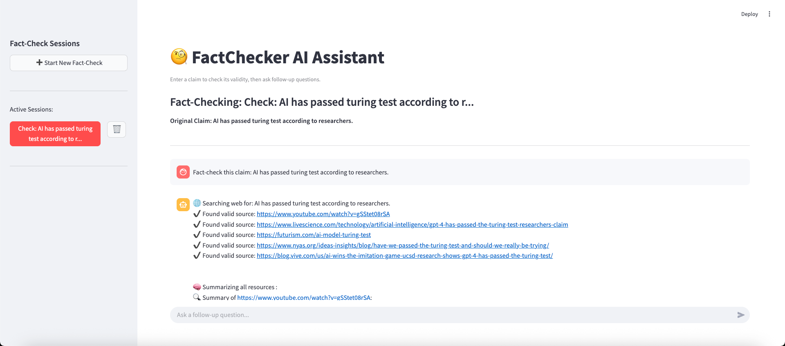
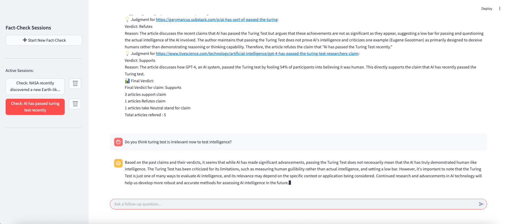

# AI Fact Checker

**AI Fact Checker** is a web-based chatbot that uses LLM agents to fact-check claims by browsing the internet for evidence, summarizing relevant content, and delivering a judgment based on the gathered information.

It leverages a modular agent-based architecture to automate the process of claim verification in a transparent and interactive way.

---

## 🌟 Key Features

- ✅ Web browsing to retrieve relevant sources
- ✅ Summarization of web content using LLM agents
- ✅ Judgment of claims based on summarized evidence
- ✅ ChatGPT-style WebUI with QnA chat support
- ✅ RAG Memory retrieves similar past claims from a vector store

## Agent Architecture

The system runs multiple collaborating agents to handle fact-checking:

### 🔍 Search Agent
Finds relevant online resources for the given claim using tools like SerpAPI or custom scrapers.

### 📖 Reader Agent
Summarizes the content of retrieved links to extract essential information.

### ⚖️ Judge Agent
Evaluates how well each summarized source supports or refutes the original claim.

### 🧠 RAG Memory 
Retrieves similar past claims from a vector store to improve current analysis.


## 🌐 Web UI Preview




## 🛠️ Getting Started

### 1. Clone the Repository

```bash
git clone https://github.com/sumitraut7/ai-fact-checker.git
cd ai-fact-checker
```
### 2. Install Dependencies
```bash
pip install -r requirements.txt
```
### 3. Setup LLM model

Download Ollama (https://ollama.com/) to setup local LLM of your choice

### 4. Start Backend Server
```bash
uvicorn main:app --reload   
```
### 5. Launch the streamlit Web-based Chatbot
```bash
streamlit run streamlit_app.py 
```
Access the app locally at: http://localhost:8501


